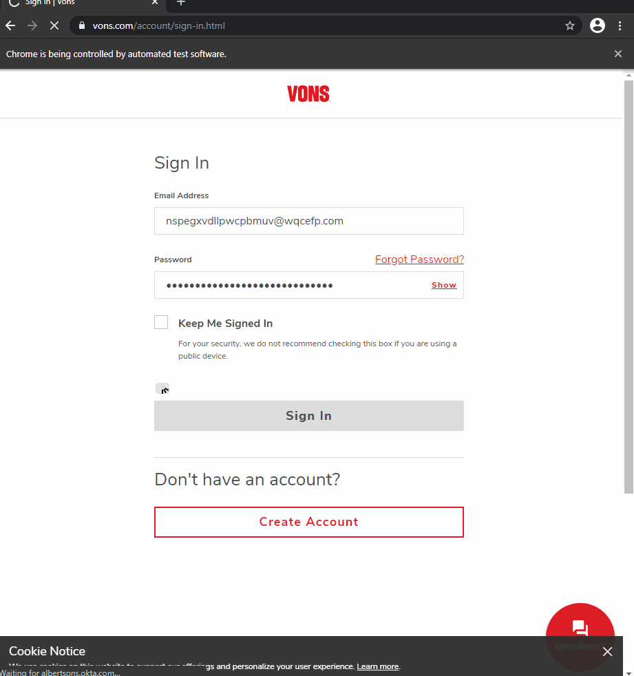

# Just4Me

[Just4Me](http://wfox-just4me.herokuapp.com/) is website that allows you to run an automation of Von's and Albertson's Just4U Virtual Coupons. 

## Motivation

The motivation behind this project was to automate the virtual coupon clicking that Von's has for their Just4U program.
One day when I was at my parents house my Mom was going through their website clicking each and every coupon on the site just in case she might buy one of the items later.
I sat down and tried to do it a bit faster by hand but it still felt like there would be a better way. 
After getting some exposure to [Selenium](https://www.selenium.dev/) I realised I could use it to automate the process. 

Later I wanted to set up the automation to run on a cron job so I wouldn't have to run the automation for my Mom and myself. 
However Windows 10 isn't as easy to set up crons as I'd like so I made a website wrapper for the original code and hosted it on [Heroku](https://heroku.com/).

## Support Me
Help get me off Heroku free dynos

[](https://www.paypal.com/donate?hosted_button_id=U65R5REYQXAR8)

## Dependencies 

* [selenium](https://pypi.org/project/selenium/)
* [webdriver-manager](https://pypi.org/project/webdriver-manager/)
* [flask](https://pypi.org/project/Flask/)
* [gunicorn](https://pypi.org/project/gunicorn/)
* [Flask-WTF](https://pypi.org/project/Flask-WTF/)
* [email_validator](https://pypi.org/project/email-validator/)

#### Dependency Installation 

`pip3 install -r requirements.txt`

## Environment Variables

```
SECRET_KEY: A secret key for Flask
TOKEN: A secret token for access control to running the automation
CHROMEDRIVER_PATH: The path to the heroku chrome driver build pack executable 
GOOGLE_CHROME_BIN: The path to the heroku chrome driver build pack binary 
ENV: Prod/Dev for running locally without heroku buildpacks requirements
``` 

* `ENV` is optional and will default to dev if left unfilled
* `CHROMEDRIVER_PATH` and `GOOGLE_CHROME_BIN` are not required in a dev environment as they're not used for local run

## How to Run

#### Pre-Requisites
* [Install the Dependencies](#dependency-installation)
* Set the [Environment Variables](#environment-variables)
     * Running via CLI 
        * `export SECRET_KEY=xxxx`
        * `export TOKEN=xxxx` 
     * Running via `heroku local`
        * Populate a `.env` file with the secrets
            * ```
                 SECRET_KEY=xxxx
                 TOKEN=xxxx
              ```
#### Running
* Via CLI
    * `python app.py`
    
* Via `heroku local`
    * Windows
        * `heroku local -f Procfile.windows`
    * Not Windows
        * `heroku local`

## Example

The website is live at https://wfox-just4me.herokuapp.com/

Automation Example, this runs headless on Heroku


## Deployment 
The bot is currently deployed on [Heroku](https://heroku.com/) using free dynos.

The deployment is automated using the [Deploy to Heroku](https://github.com/marketplace/actions/deploy-to-heroku) Action from [AkhileshNS](https://github.com/AkhileshNS).  

## Acknowledgements

* [SalvatoreTosti/flask-template](https://github.com/SalvatoreTosti/flask-template)
    * For getting me started on Heroku
    
* Corey Schafer's [Full-Featured Web App](https://www.youtube.com/watch?v=MwZwr5Tvyxo&list=PL-osiE80TeTs4UjLw5MM6OjgkjFeUxCYH)
    * For getting me comfortable with a Flask website

## Next Steps

* Notify User on Completion/Failed Login
* Fix Selenium wait for element to load/remove sleep calls
